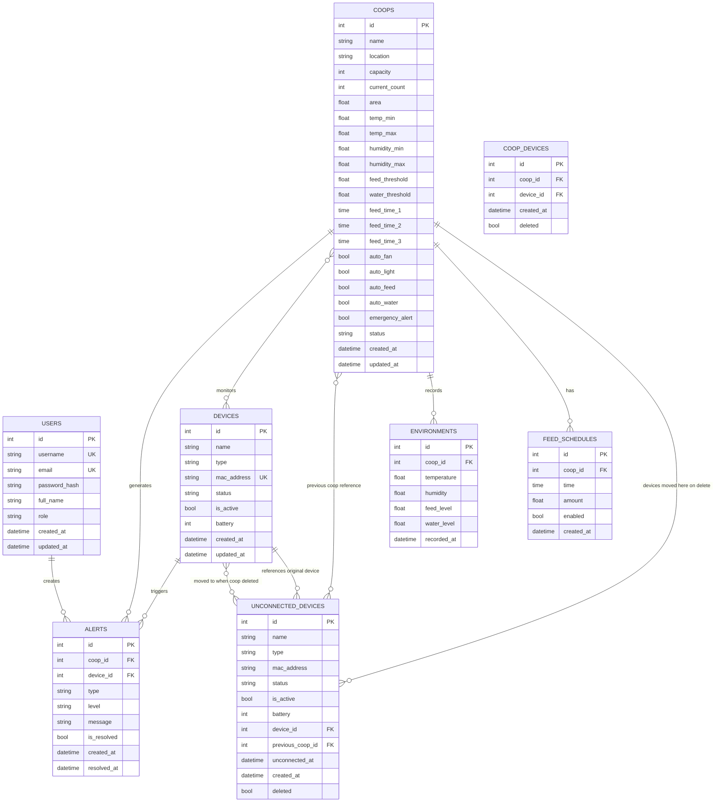

# AutomatedChickenFarmManagement

## 1. Tổng quan Dự án

**Mục tiêu:** Hệ thống quản lý trang trại gà thông minh sử dụng tự động hóa và giám sát dựa trên dữ liệu để tối ưu hóa hiệu quả chăn nuôi và sức khỏe gà.

**Trạng thái phát triển:**
- Frontend: ✓ Hoàn tất đầy đủ chức năng quản lý, SPA duy nhất (index.html)
- Backend: ✓ API đầy đủ, database models hoàn tất, WebSocket real-time

### Kiến trúc Frontend (Single Page Application)

Trang `static/index.html` là SPA duy nhất dùng Tailwind CSS CDN + Font Awesome 6 + Chart.js 4, kết nối với các API backend public (không cần JWT). Toàn bộ ứng dụng bao gồm 5 tab:

| Tab | Chức năng |
|-----|-----------|
| **Tổng quan** | Dashboard chính: 4 stat cards, quick navigation, coop list, 4 biểu đồ (nhiệt độ/độ ẩm/tồn kho thức ăn/quy mô đàn), thông báo |
| **Quản lý chuồng** | Grid danh sách chuồng + slide-in panel chi tiết với 3 tab con (Tổng quan, Thiết bị, Camera) |
| **Thiết bị** | Quản lý thiết bị IoT toàn diện: donut chart trạng thái, danh sách thiết bị có search/filter, thêm thiết bị (QR scan/code), sửa, xóa (xác nhận mã), bật/tắt. Tích hợp đầy đủ từ `device-list.html`. List giới hạn 5 card, scroll khi nhiều hơn. |
| **Quản lý kho** | *Tab placeholder* |
| **Lịch sử đàn** | *Tab placeholder* |

---

## 2. Cấu trúc Dự án

```
AutomatedChickenFarmManagement/
├── static/                      # Frontend (SPA duy nhất)
│   ├── index.html               # Single Page Application chính (≈2400 dòng)
│   └── css/js/vendor/img/       # Tài nguyên frontend
├── backend/                     # Flask Backend API
│   ├── app.py                   # Entry point
│   ├── models.py                # Database models (7 tables)
│   ├── seed.py                  # Seed dữ liệu mẫu (4 tháng)
│   ├── config.py                # Cấu hình hệ thống
│   ├── requirements.txt         # Python dependencies
│   └── api/routes/              # API Endpoints
│       ├── auth.py              # Authentication
│       ├── coops.py              # Coop CRUD
│       ├── devices.py           # Device management
│       ├── dashboard.py         # Dashboard & stats
│       ├── camera.py            # Camera control
│       ├── feed_schedule.py     # Lịch cho ăn
│       ├── environment.py       # Dữ liệu môi trường
│       ├── warehouse.py         # Kho thức ăn (feed stock)
│       └── alerts.py            # Quản lý cảnh báo
├── README.md                    # Tài liệu chính
└── .gitignore
```

---

## 3. Cấu trúc Backend & Database

### Thư mục Backend
```
backend/
├── config.py              # Cấu hình (Development/Production/Testing)
├── models.py              # Database Models (Flask-SQLAlchemy)
├── seed.py                # Seed dữ liệu mẫu (4 tháng dữ liệu)
├── requirements.txt       # Python dependencies
├── app.py                 # Flask entry point
└── api/
    ├── __init__.py       # API Blueprint Factory
    └── routes/           # API endpoints
```

### Database Schema

| Table | Mô tả | Relationships |
|-------|-------|---------------|
| `users` | Người dùng hệ thống | 1-N → alerts |
| `coops` | Chuồng gà | 1-N → environments, feed_schedules, alerts; N-N ← devices |
| `devices` | Thiết bị IoT | 1-N → alerts; N-N ← coops |
| `coop_devices` | Bảng trung gian N-N | - |
| `environments` | Dữ liệu môi trường | N-1 → coops |
| `feed_schedules` | Lịch cho ăn | N-1 → coops |
| `alerts` | Cảnh báo | N-1 → coops, devices |
| `unconnected_devices` | Thiết bị chưa kết nối | FK → devices, coops |

### ERD Sơ Đồ

       +-------------------+             +-----------------------+
       |       USER        |             |         ALERT         |
       +-------------------+             +-----------------------+
       | id (PK)           |             | id (PK)               |
       | username          |             | level (info/warn/crit)|
       | email             |             | message               |
       | password_hash     |             | is_resolved (bool)    |
       | role (admin/worker)             | resolved_at           |
       | full_name         |       +---->| coop_id (FK)          |
       | created_at        |       |     | device_id (FK)        |
       +-------------------+       |     +-----------------------+
                                   |
                                   |             
       +-------------------+       |     +-----------------------+
       |       COOP        |-------+     |      ENVIRONMENT      |
       +-------------------+             +-----------------------+
       | id (PK)           |             | id (PK)               |
       | name              |             | temperature           |
       | location          |             | humidity              |
       | capacity          |       +---->| feed_level            |
       | current_count     |       |     | water_level           |
       | status            |       |     | recorded_at           |
       | [Thresholds...]   |       |     | coop_id (FK)          |
       +---------+---------+       |     +-----------------------+
                 |                 |
                 | (1)             | (1)
                 |                 |
                 | (n)             | (n)
       +---------+---------+       |     +-----------------------+
       |    COOP_DEVICE    |-------+     |        DEVICE         |
       +-------------------+             +-----------------------+
       | id (PK)           |             | id (PK)               |
       | coop_id (FK)      |------------>| name                  |
       | device_id (FK)    |        (1)  | type (camera/sensor..)|
       +-------------------+             | status                |
                                         | mac_address           |
                                         | is_active (bool)      |
                                         +-----------------------+

### Relationships Summary

```
USERS ──────────────► ALERTS
   │                    ▲
   │                    │
   ▼                    │
COOPS ◄───────────────► DEVICES
   │                    │
   ├──► ENVIRONMENTS     │
   │                    │
   ├──► FEED_SCHEDULES  │
   │                    │
   └─► COOP_DEVICES ◄───┘
   │
   └─► UNCONNECTED_DEVICES ◄── DEVICES (FK reference)
```

### Mermaid ERD Diagram



### Chi tiết Tables (bao gồm cột deleted cho soft delete)

```
users:          id, username, email, password_hash, full_name, role, created_at, updated_at, deleted
coops:          id, name, location, capacity, current_count, area,
                 temp_min, temp_max, humidity_min, humidity_max,
                 feed_threshold, water_threshold,
                 feed_time_1, feed_time_2, feed_time_3,
                 auto_fan, auto_light, auto_feed, auto_water,
                 emergency_alert, status, created_at, updated_at, deleted
devices:        id, name, type, mac_address, status, is_active, battery, created_at, updated_at, deleted
coop_devices:   id, coop_id, device_id, is_active, created_at, deleted
environments:   id, coop_id, temperature, humidity, feed_level, water_level, recorded_at, deleted
feed_schedules: id, coop_id, time, amount, enabled, created_at, deleted
alerts:         id, coop_id, device_id, type, level, message, is_resolved, created_at, resolved_at, deleted
unconnected_devices: id, name, type, mac_address, status, is_active, battery, device_id (FK→devices), previous_coop_id (FK→coops), unconnected_at, created_at, deleted
```

**Chú thích:** Tất cả bảng có thêm cột `deleted` (Boolean, default=False) để hỗ trợ soft delete - khi xóa chỉ đánh dấu deleted=1 thay vì xóa vĩnh viễn khỏi database. Bảng `unconnected_devices` có thêm các cột `device_id`, `previous_coop_id`, `unconnected_at` để theo dõi thiết bị sau khi chuồng bị xóa.

---

## 4. API Endpoints

| Nhóm | Method | Endpoint | Mô tả |
|------|--------|----------|-------|
| **Auth** | POST | `/api/auth/login` | Đăng nhập, nhận JWT token |
| | POST | `/api/auth/register` | Đăng ký user mới |
| | GET | `/api/auth/me` | Lấy thông tin user hiện tại |
| | POST | `/api/auth/logout` | Đăng xuất |
| **Coops** | GET | `/api/coops` | Danh sách chuồng |
| | POST | `/api/coops` | Tạo chuồng mới |
| | GET | `/api/coops/<id>` | Chi tiết chuồng |
| | PUT | `/api/coops/<id>` | Cập nhật chuồng |
| | DELETE | `/api/coops/<id>` | Soft delete chuồng + chuyển thiết bị sang unconnected |
| | GET | `/api/coops/<id>/devices` | Thiết bị trong chuồng |
| | GET | `/api/coops/<id>/environment` | Dữ liệu môi trường hiện tại |
| | GET | `/api/coops/<id>/history` | Lịch sử dữ liệu |
| **Devices** | GET | `/api/devices` | Danh sách thiết bị |
| | POST | `/api/devices` | Tạo thiết bị mới |
| | POST | `/api/devices/connect` | Kết nối thiết bị (QR/mã) |
| | GET | `/api/devices/<id>` | Chi tiết thiết bị |
| | PUT | `/api/devices/<id>` | Cập nhật thiết bị |
| | DELETE | `/api/devices/<id>` | Xóa thiết bị |
| | POST | `/api/devices/<id>/toggle` | Bật/tắt thiết bị |
| | POST | `/api/devices/<id>/assign` | Gán thiết bị vào chuồng |
| | PATCH | `/api/devices/<id>/name` | Đặt tên thiết bị |
| **Dashboard** | GET | `/api/dashboard` | Tổng quan dashboard |
| | GET | `/api/dashboard/stats` | Thống kê chi tiết |
| | GET | `/api/dashboard/public` | Tổng quan dashboard (public, không cần auth) |
| | GET | `/api/dashboard/alerts` | Danh sách cảnh báo |
| | GET | `/api/dashboard/alerts-count` | Đếm cảnh báo (offline + môi trường) |
| | GET | `/api/dashboard/recent-activities` | Hoạt động gần đây |
| **Camera** | GET | `/api/camera` | Danh sách camera |
| | GET | `/api/camera/<id>` | Chi tiết camera |
| | GET | `/api/camera/coop/<id>` | Camera theo chuồng |
| | GET | `/api/camera/coop-detail/<id>` | Tổng hợp dữ liệu chuồng (coop + environment + devices) |
| | POST | `/api/camera/<id>/snapshot` | Chụp ảnh |
| | GET | `/api/camera/<id>/stream` | Lấy URL stream |
| | GET | `/api/camera/<id>/recordings` | Danh sách recordings |
| **Feed Schedule** | GET | `/api/feed-schedule` | Danh sách lịch cho ăn |
| | POST | `/api/feed-schedule` | Tạo lịch mới |
| | PUT | `/api/feed-schedule/<id>` | Cập nhật lịch |
| | DELETE | `/api/feed-schedule/<id>` | Xóa lịch |
| **Environment** | POST | `/api/environment` | Nhận dữ liệu từ IoT |
| | GET | `/api/environment/<coop_id>` | Dữ liệu môi trường hiện tại |
| | GET | `/api/environment/<coop_id>/history` | Lịch sử dữ liệu môi trường |
| **Alerts** | GET | `/api/alerts` | Danh sách cảnh báo |
| | PUT | `/api/alerts/<id>/resolve` | Đánh dấu đã xử lý |
| **Warehouse** | GET | `/api/warehouse/feed-stock` | Tồn kho thức ăn (7 ngày gần nhất) |
| | PUT | `/api/warehouse/feed-stock` | Cập nhật tồn kho thức ăn |

---

## 5. Cập nhật gần đây (May 2026)

### May 29, 2026 - Seed dữ liệu 2 tháng

| Thay đổi | File | Chi tiết |
|----------|------|----------|
| **Môi trường 2 tháng** | `backend/seed.py` | Từ 24 bản ghi/chuồng (1 ngày) → 240 bản ghi/chuồng (60 ngày × 4 lần/ngày). Nhiệt độ tăng dần, độ ẩm thay đổi. Batch insert tối ưu. |
| **Tiêu thụ thức ăn** | `backend/seed.py` | Từ 7 ngày → 60 ngày (2 tháng). Batch insert. |
| **Phiếu nhập hàng** | `backend/seed.py` | Từ 9 phiếu cố định → ~15 phiếu sinh tự động rải đều 60 ngày. Batch insert. |
| **Video recordings** | `backend/seed.py` | Từ 72 giờ → 2 tháng dữ liệu. 5-10 recording/camera. Batch insert. |
| **Cảnh báo** | `backend/seed.py` | Từ 3 cảnh báo/chuồng → 6 cảnh báo/chuồng rải đều 2 tháng, có resolved_at. Batch insert. |
| **Thiết bị IoT** | `backend/seed.py` | `last_seen` có lịch sử lên đến 2 tháng. |

### May 29, 2026 - Main Device Tab (Tab Thiết bị) từ device-list.html

| Thay đổi | File | Chi tiết |
|----------|------|----------|
| **Main Device Tab SPA** | `static/index.html` | Port toàn bộ `device-list.html` vào tab Thiết bị chính: device card layout (border-left status), donut chart, search/filter, add/edit/delete/toggle. Thay thế hoàn toàn tab placeholder. |
| **Optimistic UI — Toggle** | `static/index.html` | `toggleDevice()` flip button ngay lập tức, cập nhật `_cachedAllDevices`. Gọi API bất đồng bộ. Nếu thất bại → revert button + cache, toast lỗi. |
| **Optimistic UI — Delete** | `static/index.html` | `confirmDeleteDevice()` animate card mờ dần + trượt phải, xóa sau 350ms. Gọi API bất đồng bộ. Nếu thất bại → thêm lại device vào cache + `loadDevices()`. |
| **Add Device Flow Modal** | `static/index.html` | Wizard 5 bước riêng cho main tab (Select→Scan→Input→Waiting→Success/Fail). QR scanner qua jsQR + camera `environment`. |
| **Edit Device Modal** | `static/index.html` | Modal riêng: sửa tên, loại, chuồng, ngưỡng cảnh báo. `saveDeviceSettings()` tạm thời toast-only. |
| **Delete endpoint theo tab** | `static/index.html` | `confirmDeleteDevice()` dùng `DELETE /api/devices/public/<id>` cho main tab, `DELETE /api/coops/public/<coopId>/devices/<id>` cho Coop Detail. |
| **Toggle context fix** | `static/index.html` | `toggleDevice()` dùng `isMain = #tab-devices.active` để quyết định re-render hay không. Clear `_cachedDevices = null` cho Coop Detail. |
| **Bug: HTML section nesting** | `static/index.html` | Thêm `</section>` đóng `#tab-coops` trước `#tab-devices` — fix lỗi tab Thiết bị bị lồng trong `#tab-coops` (display:none) nên không hiển thị. |
| **Bug: isMain inversion** | `static/index.html` | `isMain` từ `classList.contains('active')` (đã sửa lỗi `!classList.contains`). |
| **Bug: Stale cache toggle** | `static/index.html` | `_cachedDevices = null` trước khi gọi `renderCoopDevices()` để force refresh sau toggle. |
| **JS dependencies added** | `static/index.html` | Thêm 4 script: `deviceStatus.js`, `donut-device-status.js`, `status-helpers.js`, `jsQR.min.js` CDN. |
| **Donut legend fix** | `static/js/donut-device-status.js` | `updateLegend()` ưu tiên `.legend-item-coop` trong container (cho `#donutChartDeviceList`) trước khi fallback `.card-body`. |
| **Device list scroll limit** | `static/index.html` | `max-height: 680px; overflow-y: auto` — hiển thị ~5 card, scroll cho phần còn lại. |
| **Dọn code cũ** | `static/index.html` | Xóa `loadMainDevices()`, `renderMainDeviceDonut()`, `renderMainDeviceList()`, `filterMainDevices()`, `mainDeleteDevice()`, `showMainAddDeviceModal()`, `getAddDeviceCoopId()` và các biến global liên quan. |
| **Đã hoàn thành** | `README.md` | Thêm checkbox: "Main Device Tab (device-list.html)", "Optimistic UI Toggle/Delete", "Add Device Flow Modal (QR + Code)", "Edit Device Modal". |

### May 28-29, 2026 - Coop Detail Full Chức năng & Dashboard Tổng quan

| Thay đổi | File | Chi tiết |
|----------|------|----------|
| **Kiến trúc SPA** | `static/index.html` | Hợp nhất tất cả trang (coop-list, coop-detail, device-list, device-detail, camera, camera-detail) vào một file SPA duy nhất với 5 tab. Xóa các file HTML cũ. |
| **Dashboard Tổng quan** | `static/index.html` | Xóa toàn bộ mock data, thay bằng async API calls qua `appState`. Thêm error banner, loading spinner, skeleton loading cho stat cards, biểu đồ, và coop list. |
| **Quick Navigation** | `static/index.html` | 4 card điều hướng nhanh đến các tab khác (Quản lý chuồng, Thiết bị, Kho, Lịch sử). |
| **Đại diện chuồng** | `static/index.html` | Hiển thị 3 chuồng đầu tiên từ API dạng card với tên, trạng thái, số gà, thiết bị. |
| **4 biểu đồ mới** | `static/index.html` | Nhiệt độ/độ ẩm (line, 24h), Tồn kho thức ăn (line, dynamic từ `appState.feedItems`), Quy mô đàn (line, 7 ngày fake). Thay biểu đồ cột (tiêu thụ) bằng đường (tồn kho). |
| **Feed stock inline edit** | `static/index.html` | Click vào giá trị tồn kho → input → PUT `/api/warehouse/feed-stock` → update toast. Cập nhật `appState.feedItems` ngay lập tức. |
| **Stat card redesign** | `static/index.html` | Icon 44px→52px, text 20px→28px. Icon `fa-cow` → inline SVG chicken silhouette. Thêm label kiểu tag (Gà con, trứng, ...). |
| **Thông báo Dashboard** | `static/index.html` | Split thành 2 phần: "Vấn đề hệ thống" (placeholder) + "Lịch nhắc tiêm phòng" (3 mục tĩnh). Mỗi mục có chip xanh/xám, nút xem chi tiết. |
| **Coop Detail tabbed panel** | `static/index.html` | Panel trượt từ `max-w-lg` (32rem) → `max-w-2xl` (42rem). Sticky header: back button + tên chuồng + badge + summary pills + tab bar 3 nút. |
| **Tab Thiết bị** | `static/index.html` | Port đầy đủ từ `device-detail.html`: card thiết bị (border-left status, status dot, name, battery, type, status label), nút toggle gọi API, nút xóa với modal confirm, nút thêm với modal search+checkbox+bulk attach, donut chart SVG 4 segment + tooltip + legend hover. |
| **Tab Camera** | `static/index.html` | Grid card camera responsive (name, status dot, placeholder gradient, LIVE badge với pulse animation). Filter device type `=== 'camera'` từ `API.getCoopDevices()`. |
| **Toggle thiết bị** | `static/index.html` | Guard connecting/offline → gọi `POST /api/devices/public/{id}/toggle` → cập nhật cả tab device lẫn overview. `_cachedDevices = null` để force refresh. |
| **Xóa thiết bị** | `static/index.html` | Modal confirm với icon cảnh báo đỏ + nút cancel/confirm. Gọi `DELETE /api/coops/public/{coopId}/devices/{id}` → toast + reload. |
| **Thêm thiết bị** | `static/index.html` | Modal với search input + scrollable checkbox list từ `GET /api/devices/public/unconnected/available`. Bulk attach qua `POST /api/devices/public/attach-to-coop`. Reset search + checkboxes mỗi lần mở. |
| **Thiết bị donut chart** | `static/index.html` | SVG inline 4 segment (active=green, connecting=yellow, error=red, waiting=gray). Hover tooltip (tọa độ mouse). Legend hover highlight segment tương ứng. |
| **Camera card design** | `static/index.html` | Dark background (#1a1a2e), border-left status color, placeholder gradient (từ primary/90 → primary/40), icon `fa-video` trắng mờ, LIVE badge xanh + pulse dot animation. |
| **Toast notification** | `static/index.html` | Hàm `showToastNotification(type, message)`: success=xanh, error=đỏ, warning=vàng. Tự động ẩn sau 3s. |
| **CSS additions** | `static/index.html` | Device card (border-left status, toggle btn on/off states, delete btn hover đỏ), status dot (green/yellow/red/gray), donut chart (SVG segments + tooltip + legend), camera card (placeholder gradient, live badge pulse, responsive grid). |
| **Backend: Warehouse API** | `backend/api/routes/warehouse.py` | File mới: `GET /api/warehouse/feed-stock` (trả về feed_stock kg + cập nhật ngẫu nhiên ±5%), `PUT /api/warehouse/feed-stock` (cập nhật số kg). |
| **Backend: Warehouse Model** | `backend/models.py` | Thêm `WarehouseInventory` model: id, feed_stock, record_date, updated_at. |
| **Backend: Seed update** | `backend/seed.py` | Thêm `seed_warehouse()` tạo 7 dòng dữ liệu feed stock 7 ngày gần nhất. Giảm ngưỡng env: temp 20-35°C (trước 0-50), humidity 50-90% (trước 0-100). |
| **Backend: Public dashboard** | `backend/api/routes/dashboard.py` | Thêm endpoint `GET /api/dashboard/public` trả về dashboard data không cần auth: totalCoops, totalDevices, onlineDevices, deviceCount + onlineDeviceCount per coop. |

### May 7, 2026 - Đồng bộ Dashboard & Tích hợp Camera Toàn diện

| Thay đổi | File | Chi tiết |
|----------|------|----------|
| Đồng bộ Dashboard | `backend/api/routes/dashboard.py` | Cập nhật tất cả các endpoint thống kê (Total Coops, Devices, Alerts, Activities) để lọc bỏ dữ liệu đã xóa mềm (`deleted=False`). |
| Dashboard Dynamic | `static/index.html` | Thêm ID `totalCoopsDisplay`, `donutTotalDisplay`, xóa giá trị tĩnh "5", "15" để cập nhật dữ liệu thực tế từ API. |
| Tích hợp Camera Seeding | `backend/seed.py` | Tất cả 5 chuồng mặc định đều có `has_camera=1` và được gán 1 thiết bị camera. Thêm các mẫu camera AI/Hồng ngoại vào danh sách chưa kết nối. |
| API Device Type | `backend/api/routes/devices.py` | Bổ sung trường `type` vào endpoint `/api/devices/public/recent` để frontend nhận diện icon. |
| Icon thiết bị động | `static/device-list.html` | Hiển thị icon tương ứng cho từng loại thiết bị (`fa-video` cho camera, `fa-thermometer-half` cho cảm biến nhiệt, v.v.) thay vì dùng chung icon wifi. |
| Tối ưu UI Camera | `static/camera.html` | Loại bỏ các nút "Xem camera" dư thừa trong danh sách tóm tắt chuồng để giao diện gọn gàng hơn. |

### May 6, 2026 - Camera Detail API + Soft Delete Chuồng với Device Migration

| Thay đổi | File | Chi tiết |
|----------|------|----------|
| API camera-detail mới | `backend/api/routes/camera.py` | Endpoint `GET /api/camera/coop-detail/<id>` trả về coop info + environment mới nhất + danh sách thiết bị đang hoạt động |
| Camera-detail dynamic | `static/camera-detail.html` | Xóa toàn bộ dữ liệu tĩnh `coopData`, thay bằng gọi API, skeleton loading, polling 30s, color-coded device status (online=xanh, connecting=vàng, offline=đỏ) |
| Camera links dùng ID | `static/camera.html` | Cập nhật tất cả link từ `?coop=A` → `?coop=<numeric_id>`, render camera cards từ API |
| Soft delete chuồng | `backend/api/routes/coops.py` | Endpoint DELETE: soft delete coop + tạo unconnected_devices + cập nhật device status=pending/is_active=False + soft delete coop_device links, tất cả trong transaction |
| UnconnectedDevice schema | `backend/models.py` | Thêm 3 cột mới: `device_id`, `previous_coop_id`, `unconnected_at` |
| Auto-migration | `backend/app.py` | Tự động `ALTER TABLE ADD COLUMN` cho các cột mới khi startup |
| Delete confirmation | `static/coop-list.html` | Modal xác nhận xóa với icon, tên chuồng, loading state, fade-out card, toast notification |

### May 6, 2026 - Cập nhật Backend Soft Delete

| Thay đổi | File | Chi tiết |
|----------|------|----------|
| Thêm cột deleted | `backend/models.py` | Thêm `deleted = db.Column(db.Boolean, default=False)` vào 8 models |
| Cập nhật DELETE queries | `backend/api/routes/devices.py` | Thay `db.session.delete()` → `deleted = True` |
| Cập nhật SELECT queries | `backend/api/routes/*.py` | Thêm `.filter(Model.deleted == False)` vào tất cả queries |
| API cảnh báo mới | `backend/api/routes/dashboard.py` | Thêm `/api/dashboard/alerts-count` |

**Models đã thêm cột deleted:** User, Coop, Device, CoopDevice, Environment, FeedSchedule, Alert, UnconnectedDevice

### May 5, 2026 - Cập nhật Index Page

| Thay đổi | File | Chi tiết |
|----------|------|----------|
| Dynamic statistics | `static/index.html` | Tổng chuồng, tổng thiết bị, thiết bị online được tính từ database |
| Loading states | `static/index.html` | Hiển thị "..." khi đang tải dữ liệu |
| Auto-refresh | `static/index.html` | Cập nhật dữ liệu mỗi 30 giây |
| Remove search | `static/index.html` | Xóa nút tìm kiếm trên topbar |
| Alert card | `static/index.html` | Viền tô vàng khi có cảnh báo |

### May 4, 2026 - Cập nhật Device List

| Thay đổi | File | Chi tiết |
|----------|------|----------|
| Toggle button | `static/device-list.html` | Hiển thị "Bật"/"Tắt" theo is_active |
| Thông tin button | `static/device-list.html` | Chỉ hiển thị cho thiết bị online/offline |
| Delete confirmation | `static/device-list.html` | Xác nhận bằng mã 4 ký tự ngẫu nhiên |
| Sort by status | `static/device-list.html` | Sắp xếp offline → connecting → online |
| Hide toggle | `static/device-list.html` | Ẩn nút toggle cho offline/connecting |
| Status badge | `static/device-list.html` | Fix CSS cho các trạng thái |

### May 2, 2026 - Bổ sung API mới

| API | File | Endpoints |
|-----|------|-----------|
| Feed Schedule | `backend/api/routes/feed_schedule.py` | GET, POST, PUT, DELETE |
| Environment | `backend/api/routes/environment.py` | POST (IoT data), GET current, GET history |
| Alerts | `backend/api/routes/alerts.py` | GET list, PUT resolve |

### May 1, 2026 - Tối ưu Dashboard API

- Chuyển các phép tính thống kê (count, sum) xuống cấp độ Database
- Sử dụng `SQLAlchemy func` thay vì Python list comprehension
- Kết quả: Tăng hiệu suất truy vấn

```python
# Trước: sum(c.current_count for c in coops)
# Sau: db.session.query(func.sum(Coop.current_count)).scalar()
```

---

## 6. Tech Stack & Setup

### Tech Stack

| Component | Technology |
|-----------|------------|
| Frontend | Tailwind CSS CDN, Bootstrap 4.6.0, jQuery 3.6.0, Chart.js 4.x, Font Awesome 6.0 |
| Backend | Python 3.x, Flask, Flask-SQLAlchemy, Flask-SocketIO |
| Database | SQLite (Development) |
| Auth | JWT (flask-jwt-extended) |
| IoT | REST API, QR Code / Manual code connection |
| Real-time | WebSocket (SocketIO) với REST polling fallback |

### Setup - Frontend Only

```bash
# Mở trực tiếp trong trình duyệt
static/index.html

# Hoặc chạy local server
python -m http.server 8000 --directory static
```

### Setup - Full (Backend + Frontend)

```bash
# 1. Di chuyển vào thư mục backend
cd backend

# 2. Tạo virtual environment
python -m venv venv

# 3. Kích hoạt virtual environment
# Windows:
venv\Scripts\activate
# Linux/Mac:
source venv/bin/activate

# 4. Cài đặt dependencies
pip install -r requirements.txt

# 5. Chạy server
python app.py
# Hoặc
flask run

# 6. Truy cập
# Frontend: http://localhost:5000
# API: http://localhost:5000/api/
```

### API Test Example

```bash
# Đăng nhập
curl -X POST http://localhost:5000/api/auth/login \
  -H "Content-Type: application/json" \
  -d '{"username": "admin", "password": "admin123"}'

# Lấy dashboard stats (cần token)
curl -X GET http://localhost:5000/api/dashboard/stats \
  -H "Authorization: Bearer <token>"
```

---

## 7. Features Planned

### Đã hoàn thành ✓

- [x] Tổng quan trang trại (Dashboard)
- [x] Số lượng gà hiện tại
- [x] Giám sát môi trường (nhiệt độ, độ ẩm)
- [x] Biểu đồ thống kê (Donut Chart, Line Chart, Area Chart)
- [x] Trạng thái thiết bị IoT
- [x] Quản lý chuồng (CRUD)
- [x] Quản lý thiết bị (CRUD, toggle, assign)
- [x] Lịch cho ăn tự động
- [x] Điều khiển tự động (quạt, đèn, cho ăn, nước)
- [x] Cảnh báo nhiệt độ
- [x] Theo dõi camera
- [x] Giao diện Mobile (Fixed Bottom Navigation)
- [x] Responsive design
- [x] **Soft Delete** - Xóa không mất dữ liệu (thêm cột deleted vào tất cả bảng)
- [x] **Xóa chuồng với device migration** - Soft delete + chuyển thiết bị sang unconnected_devices trong transaction
- [x] **Xác nhận xóa thiết bị** - Mã 4 ký tự ngẫu nhiên
- [x] **Sắp xếp thiết bị** - Ưu tiên offline → connecting → online
- [x] **Thông tin thiết bị** - Modal hiển thị chi tiết và chỉnh sửa tên
- [x] **Cảnh báo động** - Tính từ database, viền vàng khi có cảnh báo
- [x] **Tự động làm mới** - Cập nhật dữ liệu mỗi 30 giây
- [x] **Camera detail dynamic** - API tổng hợp, skeleton loading, realtime polling 30s, color-coded device status
- [x] **Single Page Application** - Hợp nhất tất cả trang vào `index.html` duy nhất với 5 tab
- [x] **Dashboard tổng quan động** - Async API calls, skeleton loading, error banner, 4 biểu đồ thời gian thực
- [x] **Feed stock inline edit** - Click giá trị tồn kho → input → PUT API → update toast
- [x] **Coop Detail tabbed panel** - 3 tab (Tổng quan/Thiết bị/Camera) với đầy đủ chức năng toggle/xóa/thêm thiết bị
- [x] **Device Donut Chart** - SVG 4 segment (active/connecting/error/waiting) + tooltip + legend
- [x] **Add Device Modal** - Search + checkbox list + bulk attach từ unconnected devices
- [x] **Delete Device Modal** - Confirm dialog với icon cảnh báo
- [x] **Camera Card Grid** - Responsive grid, placeholder gradient, LIVE badge pulse animation
- [x] **Warehouse Feed Stock API** - GET/PUT tồn kho, 7 ngày lịch sử tự động seed
- [x] **Toast Notification** - Success/error/warning feedback 3s tự động ẩn
- [x] **Main Device Tab (device-list.html)** - Quản lý thiết bị IoT toàn diện trong tab Thiết bị chính: donut chart, search/filter, add/edit/delete/toggle
- [x] **Optimistic UI Toggle & Delete** - Flip/remove ngay lập tức, gọi API bất đồng bộ, revert nếu thất bại
- [x] **Add Device Flow Modal (QR + Code)** - Wizard 5 bước: Select→Scan→Input→Waiting→Success/Fail
- [x] **Edit Device Modal** - Sửa tên, loại, chuồng, ngưỡng cảnh báo
- [x] **Delete code confirmation** - Xác nhận xóa bằng mã 4 ký tự ngẫu nhiên (cả main tab và Coop Detail)
- [x] **Device list scroll** - Giới hạn ~5 card, scroll cho nhiều hơn

### Chưa hoàn thành

- [ ] Thêm/xóa/sửa thông tin gà (Chicken management)
- [ ] Theo dõi tuổi, giống, cân nặng gà
- [ ] Ghi chép tiêm phòng, lịch sử sức khỏe
- [ ] Cài đặt lượng thức ăn chi tiết
- [ ] Thống kê tiêu thụ thức ăn/nước
- [ ] Xuất báo cáo Excel/PDF
- [ ] Biểu đồ tăng trọng
- [ ] Thống kê sản lượng trứng

---

## License

MIT License