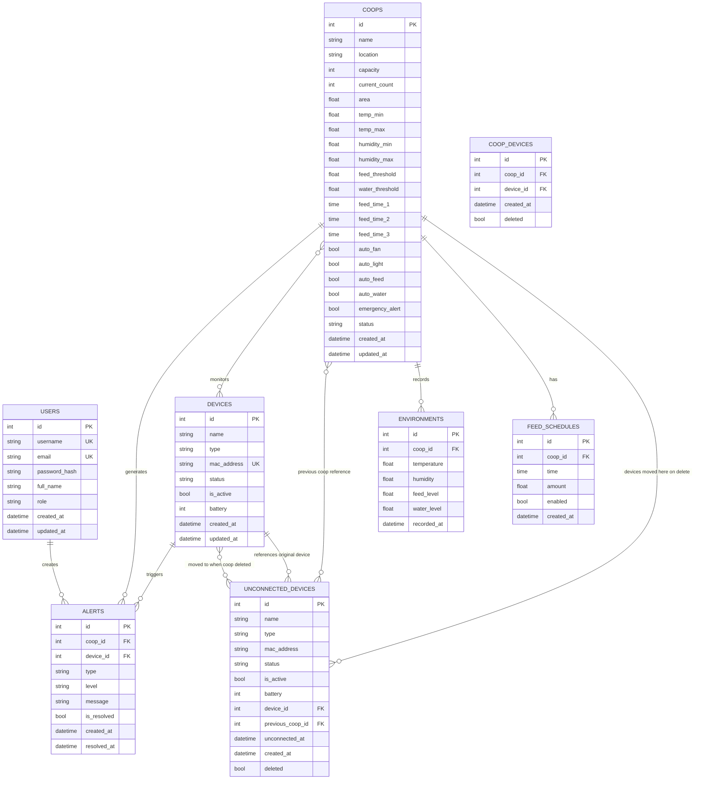

# AutomatedChickenFarmManagement

## 1. Tổng quan Dự án

**Mục tiêu:** Hệ thống quản lý trang trại gà thông minh sử dụng tự động hóa và giám sát dựa trên dữ liệu để tối ưu hóa hiệu quả chăn nuôi và sức khỏe gà.

**Trạng thái phát triển:**
- Frontend: ✓ Hoàn tất đầy đủ chức năng quản lý + Camera AI Dashboard
- Backend: ✓ API đầy đủ, database models hoàn tất, WebSocket real-time, AI Detection Pipeline
- AI/Computer Vision: ✓ YOLO detection pipeline, video/image file processing, 45s interval analysis

---

## 2. Cấu trúc Dự án

```
AutomatedChickenFarmManagement/
├── static/                      # Frontend (SB Admin 2 theme)
│   ├── index.html               # Dashboard chính (có tab Camera AI)
│   ├── coop-list.html           # Danh sách chuồng
│   ├── coop-detail.html         # Chi tiết chuồng
│   ├── device-list.html          # Danh sách thiết bị
│   ├── device-detail.html        # Chi tiết thiết bị
│   ├── camera.html              # Danh sách camera
│   ├── camera-detail.html       # Chi tiết camera
│   ├── other.html               # Chức năng khác
│   └── css/js/vendor/img/       # Tài nguyên frontend
│       └── ai_detections/       # Ảnh AI detection output (auto-generated)
├── backend/                     # Flask Backend API
│   ├── run.py                   # Entry point (khởi tạo services + socketio)
│   ├── models.py                # Database models (9 tables)
│   ├── config.py                # Cấu hình hệ thống
│   ├── requirements.txt         # Python dependencies
│   ├── seed.py                  # Seed dữ liệu mẫu
│   ├── websocket_server.py      # SocketIO WebSocket handlers
│   ├── video_path.txt           # Danh sách file video/image cho camera test
 │   └── services/                # Background Services
 │       ├── __init__.py                # Package init
  │       ├── camera_stream_worker.py    # Camera stream processing (45s interval)
 │       ├── detection_pipeline.py      # YOLO AI detection pipeline
 │       ├── stream_manager.py          # Multi-camera worker management
 │       └── video_processor.py         # Video file processing (every 10s timestamp)
│   └── api/routes/              # API Endpoints
│       ├── auth.py              # Authentication
│       ├── coops.py              # Coop CRUD
│       ├── devices.py           # Device management
│       ├── dashboard.py         # Dashboard & stats
│       ├── camera.py            # Camera control + AI detection config
│       ├── feed_schedule.py     # Lịch cho ăn
│       ├── environment.py       # Dữ liệu môi trường
│       ├── alerts.py            # Quản lý cảnh báo
│       ├── ai_detection.py      # AI detection endpoints
│       ├── warehouse.py         # Kho thức ăn/thuốc
│       └── pages.py             # Frontend page routing
├── README.md                    # Tài liệu chính
├── .gitignore
└── runs/                        # YOLO training outputs
    └── detect/
        └── runs/
            └── my_project/
                └── model_detect_disease/
                    └── weights/
                        ├── best.pt
                        └── last.pt
```

---

## 3. Cấu trúc Backend & Database

### Thư mục Backend
```
backend/
├── config.py              # Cấu hình (Development/Production/Testing)
├── models.py              # Database Models (Flask-SQLAlchemy)
├── requirements.txt       # Python dependencies
├── app.py                 # Flask Application Factory
├── run.py                 # Entry point (khởi tạo services + socketio)
├── websocket_server.py    # SocketIO WebSocket handlers
├── video_path.txt         # Danh sách file video/image cho camera test
├── services/              # Background Services
│   ├── __init__.py
│   ├── camera_stream_worker.py
│   ├── detection_pipeline.py
│   ├── stream_manager.py
│   └── video_processor.py
└── api/
    ├── __init__.py       # API Blueprint Factory
    └── routes/           # API endpoints
```

### Database Schema

| Table | Mô tả | Relationships |
|-------|-------|---------------|
| `users` | Người dùng hệ thống | 1-N → alerts |
| `coops` | Chuồng gà | 1-N → environments, feed_schedules, alerts; N-N ← devices |
| `devices` | Thiết bị IoT | 1-N → alerts; N-N ← coops |
| `coop_devices` | Bảng trung gian N-N | - |
| `environments` | Dữ liệu môi trường | N-1 → coops |
| `feed_schedules` | Lịch cho ăn | N-1 → coops |
| `alerts` | Cảnh báo | N-1 → coops, devices |
| `unconnected_devices` | Thiết bị chưa kết nối | FK → devices, coops |
| `video_recordings` | Video recordings camera | N-1 → devices, coops |
| `ai_detections` | Kết quả AI detection (gà/bệnh) | N-1 → devices, coops |
| `warehouse_inventory` | Kho thức ăn/thuốc | - |
| `feed_consumption` | Tiêu thụ thức ăn theo ngày | N-1 → coops |
| `medicine_consumption` | Tiêu thụ thuốc theo ngày | N-1 → coops |

### ERD Sơ Đồ

       +-------------------+             +-----------------------+
       |       USER        |             |         ALERT         |
       +-------------------+             +-----------------------+
       | id (PK)           |             | id (PK)               |
       | username          |             | level (info/warn/crit)|
       | email             |             | message               |
       | password_hash     |             | is_resolved (bool)    |
       | role (admin/worker)             | resolved_at           |
       | full_name         |       +---->| coop_id (FK)          |
       | created_at        |       |     | device_id (FK)        |
       +-------------------+       |     +-----------------------+
                                   |
                                   |             
       +-------------------+       |     +-----------------------+
       |       COOP        |-------+     |      ENVIRONMENT      |
       +-------------------+             +-----------------------+
       | id (PK)           |             | id (PK)               |
       | name              |             | temperature           |
       | location          |             | humidity              |
       | capacity          |       +---->| feed_level            |
       | current_count     |       |     | water_level           |
       | status            |       |     | recorded_at           |
       | [Thresholds...]   |       |     | coop_id (FK)          |
       +---------+---------+       |     +-----------------------+
                 |                 |
                 | (1)             | (1)
                 |                 |
                 | (n)             | (n)
       +---------+---------+       |     +-----------------------+
       |    COOP_DEVICE    |-------+     |        DEVICE         |
       +-------------------+             +-----------------------+
       | id (PK)           |             | id (PK)               |
       | coop_id (FK)      |------------>| name                  |
       | device_id (FK)    |        (1)  | type (camera/sensor..)|
       +-------------------+             | status                |
                                         | mac_address           |
                                         | is_active (bool)      |
                                         +-----------------------+

### Relationships Summary

```
USERS ──────────────► ALERTS
   │                    ▲
   │                    │
   ▼                    │
COOPS ◄───────────────► DEVICES
   │                    │
   ├──► ENVIRONMENTS     │
   │                    │
   ├──► FEED_SCHEDULES  │
   │                    │
   └─► COOP_DEVICES ◄───┘
   │
   └─► UNCONNECTED_DEVICES ◄── DEVICES (FK reference)
```

### Mermaid ERD Diagram



### Chi tiết Tables (bao gồm cột deleted cho soft delete)

```
users:                    id, username, email, password_hash, full_name, role, created_at, updated_at, deleted
coops:                    id, name, location, capacity, current_count, area,
                          temp_min, temp_max, humidity_min, humidity_max,
                          feed_threshold, water_threshold,
                          feed_time_1, feed_time_2, feed_time_3,
                          auto_fan, auto_light, auto_feed, auto_water,
                          emergency_alert, status, has_camera, created_at, updated_at, deleted
devices:                  id, name, type, mac_address, status, is_active, battery,
                          stream_url, stream_type, stream_enabled, frame_skip, analysis_interval_seconds,
                          created_at, updated_at, deleted
coop_devices:             id, coop_id, device_id, is_active, created_at, deleted
environments:             id, coop_id, temperature, humidity, feed_level, water_level, recorded_at, deleted
feed_schedules:           id, coop_id, time, amount, enabled, created_at, deleted
alerts:                   id, coop_id, device_id, type, level, message, is_resolved, created_at, resolved_at, deleted
unconnected_devices:      id, name, type, mac_address, status, is_active, battery,
                          device_id (FK→devices), previous_coop_id (FK→coops), unconnected_at, created_at, deleted
video_recordings:         id, device_id, coop_id, name, source_type, source_value,
                          thumbnail_url, duration, file_size, recorded_at, created_at, updated_at, deleted
ai_detections:            id, device_id, coop_id, source_file, chicken_count, has_disease,
                          diseases (JSON), details (JSON), image_path, detected_at, created_at, deleted
warehouse_inventory:      id, item_name, item_type, quantity_kg, min_threshold_kg, unit, updated_at, deleted
feed_consumption:         id, coop_id, recorded_date, quantity_kg
medicine_consumption:     id, coop_id, recorded_date, quantity_kg
```

**Chú thích:** Tất cả bảng có thêm cột `deleted` (Boolean, default=False) để hỗ trợ soft delete - khi xóa chỉ đánh dấu deleted=1 thay vì xóa vĩnh viễn khỏi database. Bảng `unconnected_devices` có thêm các cột `device_id`, `previous_coop_id`, `unconnected_at` để theo dõi thiết bị sau khi chuồng bị xóa.

---

## 4. API Endpoints

| Nhóm | Method | Endpoint | Mô tả |
|------|--------|----------|-------|
| **Auth** | POST | `/api/auth/login` | Đăng nhập, nhận JWT token |
| | POST | `/api/auth/register` | Đăng ký user mới |
| | GET | `/api/auth/me` | Lấy thông tin user hiện tại |
| | POST | `/api/auth/logout` | Đăng xuất |
| **Coops** | GET | `/api/coops` | Danh sách chuồng |
| | POST | `/api/coops` | Tạo chuồng mới |
| | GET | `/api/coops/<id>` | Chi tiết chuồng |
| | PUT | `/api/coops/<id>` | Cập nhật chuồng |
| | DELETE | `/api/coops/<id>` | Soft delete chuồng + chuyển thiết bị sang unconnected |
| | GET | `/api/coops/<id>/devices` | Thiết bị trong chuồng |
| | GET | `/api/coops/<id>/environment` | Dữ liệu môi trường hiện tại |
| | GET | `/api/coops/<id>/history` | Lịch sử dữ liệu |
| **Devices** | GET | `/api/devices` | Danh sách thiết bị |
| | POST | `/api/devices` | Tạo thiết bị mới |
| | POST | `/api/devices/connect` | Kết nối thiết bị (QR/mã) |
| | GET | `/api/devices/<id>` | Chi tiết thiết bị |
| | PUT | `/api/devices/<id>` | Cập nhật thiết bị |
| | DELETE | `/api/devices/<id>` | Xóa thiết bị |
| | POST | `/api/devices/<id>/toggle` | Bật/tắt thiết bị |
| | POST | `/api/devices/<id>/assign` | Gán thiết bị vào chuồng |
| | PATCH | `/api/devices/<id>/name` | Đặt tên thiết bị |
| **Dashboard** | GET | `/api/dashboard` | Tổng quan dashboard |
| | GET | `/api/dashboard/stats` | Thống kê chi tiết |
| | GET | `/api/dashboard/alerts` | Danh sách cảnh báo |
| | GET | `/api/dashboard/alerts-count` | Đếm cảnh báo (offline + môi trường) |
| | GET | `/api/dashboard/recent-activities` | Hoạt động gần đây |
| **Camera** | GET | `/api/camera` | Danh sách camera |
| | GET | `/api/camera/<id>` | Chi tiết camera |
| | GET | `/api/camera/coop/<id>` | Camera theo chuồng |
| | GET | `/api/camera/coop-detail/<id>` | Tổng hợp dữ liệu chuồng (coop + environment + devices) |
| | POST | `/api/camera/<id>/snapshot` | Chụp ảnh |
| | GET | `/api/camera/<id>/stream` | Lấy URL stream |
| | GET | `/api/camera/<id>/recordings` | Danh sách recordings |
| | GET | `/api/camera/<id>/stream-config` | Cấu hình stream (url, type, enabled, frame_skip, analysis_interval) |
| | PUT | `/api/camera/<id>/stream-config` | Cập nhật cấu hình stream |
| | POST | `/api/camera/<id>/detection/start` | Bắt đầu AI detection |
| | POST | `/api/camera/<id>/detection/stop` | Dừng AI detection |
| | GET | `/api/camera/<id>/detection/status` | Trạng thái detection worker |
| | POST | `/api/camera/detection/start-all` | Bắt đầu detection tất cả camera |
| | POST | `/api/camera/detection/stop-all` | Dừng detection tất cả camera |
| | GET | `/api/camera/detection/status-all` | Trạng thái tất cả detection workers |
| | GET | `/api/camera/video-path` | Đọc video_path.txt |
| | GET | `/api/camera/video-paths` | Đọc tất cả paths từ video_path.txt |
| | PUT | `/api/camera/video-path` | Cập nhật video_path.txt |
| **AI Detection** | POST | `/api/ai/detect` | Chạy AI detection trên file |
| | POST | `/api/ai/detect-all` | Chạy AI detection trên tất cả camera đang hoạt động |
| | POST | `/api/ai/process-video` | Xử lý video file (background task, mỗi 10s detect 1 frame) |
| | GET | `/api/ai/process-video/<task_id>` | Poll trạng thái xử lý video |
| | GET | `/api/ai/detections` | Lấy lịch sử detection (filter coop/device) |
| | GET | `/api/ai/detections/<id>` | Chi tiết detection |
| **Feed Schedule** | GET | `/api/feed-schedule` | Danh sách lịch cho ăn |
| | POST | `/api/feed-schedule` | Tạo lịch mới |
| | PUT | `/api/feed-schedule/<id>` | Cập nhật lịch |
| | DELETE | `/api/feed-schedule/<id>` | Xóa lịch |
| **Environment** | POST | `/api/environment` | Nhận dữ liệu từ IoT |
| | GET | `/api/environment/<coop_id>` | Dữ liệu môi trường hiện tại |
| | GET | `/api/environment/<coop_id>/history` | Lịch sử dữ liệu môi trường |
| **Alerts** | GET | `/api/alerts` | Danh sách cảnh báo |
| | PUT | `/api/alerts/<id>/resolve` | Đánh dấu đã xử lý |

---

## 5. Cập nhật gần đây (May 2026)

### May 7, 2026 - Đồng bộ Dashboard & Tích hợp Camera Toàn diện

| Thay đổi | File | Chi tiết |
|----------|------|----------|
| Đồng bộ Dashboard | `backend/api/routes/dashboard.py` | Cập nhật tất cả các endpoint thống kê (Total Coops, Devices, Alerts, Activities) để lọc bỏ dữ liệu đã xóa mềm (`deleted=False`). |
| Dashboard Dynamic | `static/index.html` | Thêm ID `totalCoopsDisplay`, `donutTotalDisplay`, xóa giá trị tĩnh "5", "15" để cập nhật dữ liệu thực tế từ API. |
| Tích hợp Camera Seeding | `backend/seed.py` | Tất cả 5 chuồng mặc định đều có `has_camera=1` và được gán 1 thiết bị camera. Thêm các mẫu camera AI/Hồng ngoại vào danh sách chưa kết nối. |
| API Device Type | `backend/api/routes/devices.py` | Bổ sung trường `type` vào endpoint `/api/devices/public/recent` để frontend nhận diện icon. |
| Icon thiết bị động | `static/device-list.html` | Hiển thị icon tương ứng cho từng loại thiết bị (`fa-video` cho camera, `fa-thermometer-half` cho cảm biến nhiệt, v.v.) thay vì dùng chung icon wifi. |
| Tối ưu UI Camera | `static/camera.html` | Loại bỏ các nút "Xem camera" dư thừa trong danh sách tóm tắt chuồng để giao diện gọn gàng hơn. |

### May 6, 2026 - Camera Detail API + Soft Delete Chuồng với Device Migration

| Thay đổi | File | Chi tiết |
|----------|------|----------|
| API camera-detail mới | `backend/api/routes/camera.py` | Endpoint `GET /api/camera/coop-detail/<id>` trả về coop info + environment mới nhất + danh sách thiết bị đang hoạt động |
| Camera-detail dynamic | `static/camera-detail.html` | Xóa toàn bộ dữ liệu tĩnh `coopData`, thay bằng gọi API, skeleton loading, polling 30s, color-coded device status (online=xanh, connecting=vàng, offline=đỏ) |
| Camera links dùng ID | `static/camera.html` | Cập nhật tất cả link từ `?coop=A` → `?coop=<numeric_id>`, render camera cards từ API |
| Soft delete chuồng | `backend/api/routes/coops.py` | Endpoint DELETE: soft delete coop + tạo unconnected_devices + cập nhật device status=pending/is_active=False + soft delete coop_device links, tất cả trong transaction |
| UnconnectedDevice schema | `backend/models.py` | Thêm 3 cột mới: `device_id`, `previous_coop_id`, `unconnected_at` |
| Auto-migration | `backend/app.py` | Tự động `ALTER TABLE ADD COLUMN` cho các cột mới khi startup |
| Delete confirmation | `static/coop-list.html` | Modal xác nhận xóa với icon, tên chuồng, loading state, fade-out card, toast notification |

### May 6, 2026 - Cập nhật Backend Soft Delete

| Thay đổi | File | Chi tiết |
|----------|------|----------|
| Thêm cột deleted | `backend/models.py` | Thêm `deleted = db.Column(db.Boolean, default=False)` vào 8 models |
| Cập nhật DELETE queries | `backend/api/routes/devices.py` | Thay `db.session.delete()` → `deleted = True` |
| Cập nhật SELECT queries | `backend/api/routes/*.py` | Thêm `.filter(Model.deleted == False)` vào tất cả queries |
| API cảnh báo mới | `backend/api/routes/dashboard.py` | Thêm `/api/dashboard/alerts-count` |

**Models đã thêm cột deleted:** User, Coop, Device, CoopDevice, Environment, FeedSchedule, Alert, UnconnectedDevice

### May 5, 2026 - Cập nhật Index Page

| Thay đổi | File | Chi tiết |
|----------|------|----------|
| Dynamic statistics | `static/index.html` | Tổng chuồng, tổng thiết bị, thiết bị online được tính từ database |
| Loading states | `static/index.html` | Hiển thị "..." khi đang tải dữ liệu |
| Auto-refresh | `static/index.html` | Cập nhật dữ liệu mỗi 30 giây |
| Remove search | `static/index.html` | Xóa nút tìm kiếm trên topbar |
| Alert card | `static/index.html` | Viền tô vàng khi có cảnh báo |

### May 4, 2026 - Cập nhật Device List

| Thay đổi | File | Chi tiết |
|----------|------|----------|
| Toggle button | `static/device-list.html` | Hiển thị "Bật"/"Tắt" theo is_active |
| Thông tin button | `static/device-list.html` | Chỉ hiển thị cho thiết bị online/offline |
| Delete confirmation | `static/device-list.html` | Xác nhận bằng mã 4 ký tự ngẫu nhiên |
| Sort by status | `static/device-list.html` | Sắp xếp offline → connecting → online |
| Hide toggle | `static/device-list.html` | Ẩn nút toggle cho offline/connecting |
| Status badge | `static/device-list.html` | Fix CSS cho các trạng thái |

### May 2, 2026 - Bổ sung API mới

| API | File | Endpoints |
|-----|------|-----------|
| Feed Schedule | `backend/api/routes/feed_schedule.py` | GET, POST, PUT, DELETE |
| Environment | `backend/api/routes/environment.py` | POST (IoT data), GET current, GET history |
| Alerts | `backend/api/routes/alerts.py` | GET list, PUT resolve |

### May 1, 2026 - Tối ưu Dashboard API

- Chuyển các phép tính thống kê (count, sum) xuống cấp độ Database
- Sử dụng `SQLAlchemy func` thay vì Python list comprehension
- Kết quả: Tăng hiệu suất truy vấn

```python
# Trước: sum(c.current_count for c in coops)
# Sau: db.session.query(func.sum(Coop.current_count)).scalar()
```

---

### June 13, 2026 - Camera AI Detection Pipeline & Video File Processing

| Thay đổi | File | Chi tiết |
|----------|------|----------|
| **CameraStreamWorker: File Support** | `backend/services/camera_stream_worker.py` | Hỗ trợ đọc file local (video lặp lại khi hết, ảnh tĩnh), detect file type (video/image/stream), time-based processing 10s interval thay vì frame_skip |
| **StreamManager: video_path.txt Integration** | `backend/services/stream_manager.py` | Đọc `video_path.txt`, phân phối file cho 5 Camera 2 devices (xen kẽ video/image), tự động dùng CameraStreamWorker cho file local |
| **Default Real Workers** | `backend/services/stream_manager.py` | `use_mock_workers = False` mặc định, chỉ dùng mock khi không có stream/file |
| **Camera AI Dashboard Tab** | `static/index.html` | Thêm tab "Camera AI" với grid 5 camera cards, stats real-time (tổng/online/bệnh/gà), WebSocket subscription, auto-refresh 10s |
| **WebSocket Camera Events** | `static/js/ws-manager.js` | Thêm event `detection_result`, `camera_status`, methods `subscribeCamera()`, `subscribeCameraStatus()`, auto-rejoin rooms on reconnect |
| **Camera Detection API** | `static/js/api.js` | Thêm `cameraAPI.subscribeDetection()`, `subscribeCameraStatus()`, `getCameraDetection()` |
| **Detection Pipeline: Save Annotated Frame** | `backend/services/detection_pipeline.py` | Thêm `save_annotated_frame()` lưu ảnh có annotation với filename `detection_{device_id}_{YYYYMMDD_HHMMSS}.jpg` |
| **WebSocket Payload** | `backend/websocket_server.py`, `backend/app.py` | `emit_detection_result` bao gồm `image_path`, base64 frame, detection data |
| **API Endpoints** | `backend/api/routes/camera.py` | GET/PUT `/api/camera/<id>/stream-config` bao gồm `analysis_interval_seconds` |

**Kết quả:**
- 5 Camera 2 workers chạy real-time, mỗi 10s phân tích 1 frame từ video/image file
- Ảnh annotated lưu vào `static/ai_detections/detection_{id}_{timestamp}.jpg`
- Frontend Camera AI tab hiển thị real-time qua WebSocket (không cần polling)
- Tự động phát hiện bệnh gà → tạo Alert level=warning

### June 13, 2026 - Update 2: Batch Detection & Video File Processing & Camera 1 Guards

| Thay đổi | File | Chi tiết |
|----------|------|----------|
| **Video Processor Service** | `backend/services/video_processor.py` | Module xử lý video: mỗi 10s timestamp seek 1 frame → YOLO detect → lưu ảnh `{video_name}_{giây}.jpg` |
| **Background Task Manager** | `backend/services/video_processor.py` | Quản lý async task bằng threading, progress tracking, status polling |
| **API process-video** | `backend/api/routes/ai_detection.py` | `POST /api/ai/process-video` start task + `GET /api/ai/process-video/<task_id>` poll status |
| **API detect-all** | `backend/api/routes/ai_detection.py` | `POST /api/ai/detect-all` force detection trên tất cả workers |
| **Force detection** | `backend/services/camera_stream_worker.py` | Thêm `force_detect()` method, lưu `latest_raw_frame` |
| **Fix run.py** | `backend/run.py` | Thêm `sys.path.insert(0, ...)`, `init_stream_manager()`, `socketio.run()` |
| **Auto detection on page load** | `static/index.html` | `renderAIDetection()`, `runAIDetection()`, xoá throttle 60s, auto-run on Camera tab |
| **Frontend detectAll API** | `static/js/api.js` | `cameraAPI.detectAll()` |
| **Fix response_data scope bug** | `backend/api/routes/ai_detection.py` | Di chuyển `response_data = detection.to_dict()` ra ngoài `if` block để tránh `UnboundLocalError` |

**Kết quả:**
- Có thể force detect tất cả camera ngay lập tức qua API hoặc UI
- Xử lý video file background không block request
- Auto detect khi load trang Camera AI tab (không cần click nút)
- Ảnh annotated từ video lưu với tên `{video_name}_{giây}.jpg` để dễ lookup theo timestamp

### June 14, 2026 - Update 3: Camera 2 File Naming, Counter, Cleanup & 45s Interval

| Thay đổi | File | Chi tiết |
|----------|------|----------|
| **Interval 45s** | `backend/services/camera_stream_worker.py` | Default `analysis_interval_seconds` thay đổi từ 10 → **45 giây** |
| **Interval 45s** | `backend/services/stream_manager.py` | `analysis_interval` default thay đổi từ 10 → **45 giây** |
| **New File Naming** | `backend/services/detection_pipeline.py` | `save_annotated_frame()` dùng tên mới `camera_2_{id_chuồng}_{counter}.jpg` thay vì `detection_{device_id}_{timestamp}.jpg` |
| **Sequential Counter** | `backend/services/detection_pipeline.py` | `_save_counter` tăng dần, không phụ thuộc vào DB record ID (giảm ~9600 writes/ngày) |
| **Auto Cleanup** | `backend/services/detection_pipeline.py` | `_cleanup_old_files()`: giữ 50 file `camera_2_*` gần nhất, cleanup tự động sau mỗi 10 lần lưu |
| **Remove Duplicate Save** | `backend/services/detection_pipeline.py` | `save_detection_to_db()` xóa bỏ việc lưu ảnh trùng lặp; thay vào đó nhận `image_path` từ `save_annotated_frame()` |
| **image_path Column** | `backend/models.py` | Thêm cột `image_path` vào `AIDetection` model để lưu URL ảnh disease detection |
| **image_path Column** | DB migration | `ALTER TABLE ai_detections ADD COLUMN image_path TEXT` |
| **Use image_path from DB** | `backend/api/routes/ai_detection.py` | `GET /detections` và `GET /detections/<id>` đọc `image_url` từ `d.image_path` thay vì ghép tên file `detection_{id}.jpg` |
| **New Save Flow** | `backend/services/camera_stream_worker.py` | `_process_frame()`: lưu ảnh annotated trước → `save_annotated_frame()` → nếu có bệnh, gọi `save_detection_to_db(image_path=...)` |

**Kết quả:**
- File naming mới: `static/ai_detections/camera_2_1_5.jpg` (camera_2_{coop_id}_{counter})
- Chỉ giữ 50 file gần nhất, cleanup tự động
- Camera 1 hoàn toàn bị loại khỏi AI detection (guard trên tất cả endpoints)
- `AIDetection.image_path` lưu trong DB để frontend hiển thị ảnh bệnh chính xác
- Khoảng cách phân tích tăng lên 45 giây (giảm tải server)

## 6. Tech Stack & Setup

### Tech Stack

| Component | Technology |
|-----------|------------|
| Frontend | Bootstrap 4.6.0, jQuery 3.6.0, Chart.js 3.x, Font Awesome 6.0 |
| Backend | Python 3.x, Flask, Flask-SQLAlchemy, Flask-SocketIO |
| Database | SQLite (Development) |
| Auth | JWT (flask-jwt-extended) |
| IoT | REST API, QR Code / Manual code connection |
| Real-time | WebSocket (SocketIO) với REST polling fallback |
| AI/Computer Vision | YOLOv8 (ultralytics), OpenCV, PyTorch, TorchVision |
| Video Processing | OpenCV VideoCapture (local files, RTSP, HTTP streams) |

### Setup - Frontend Only

```bash
# Mở trực tiếp trong trình duyệt
static/index.html

# Hoặc chạy local server
python -m http.server 8000 --directory static
```

### Setup - Full (Backend + Frontend)

```bash
# 1. Di chuyển vào thư mục backend
cd backend

# 2. Tạo virtual environment
python -m venv venv

# 3. Kích hoạt virtual environment
# Windows:
venv\Scripts\activate
# Linux/Mac:
source venv/bin/activate

# 4. Cài đặt dependencies
pip install -r requirements.txt

# 5. Chạy server (dùng run.py để đảm bảo services khởi tạo đúng)
python run.py

# 6. Truy cập
# Frontend: http://localhost:5000
# API: http://localhost:5000/api/
```

### Cấu hình Camera AI Test (Video/Image Files)

File `video_path.txt` (ở root project) chứa danh sách đường dẫn video/image để test camera AI:

```
D:\Share_Projects\AutomatedChickenFarmManagement\avian-pox-in-chickens-1024x705-1-768x529.jpg
D:\Share_Projects\AutomatedChickenFarmManagement\backend\Camera_AI\Data\Test_data\Videos\video_test.mp4
```

- Hệ thống tự động đọc file này khi khởi động StreamManager
- 5 Camera 2 devices sẽ được phân phối xen kẽ các file này
- Video file: lặp lại liên tục khi phát hết
- Image file: xử lý cùng một ảnh mỗi 45s (giả lập camera tĩnh)
- Kết quả annotated image lưu tại: `static/ai_detections/camera_2_{coop_id}_{counter}.jpg`
- Tự động cleanup: giữ 50 file `camera_2_*` gần nhất, dọn mỗi 10 lần lưu

### API Test Example

```bash
# Đăng nhập
curl -X POST http://localhost:5000/api/auth/login \
  -H "Content-Type: application/json" \
  -d '{"username": "admin", "password": "admin123"}'

# Lấy dashboard stats (cần token)
curl -X GET http://localhost:5000/api/dashboard/stats \
  -H "Authorization: Bearer <token>"
```

### Camera AI Test Example

```bash
# Lấy cấu hình stream camera
curl -X GET http://localhost:5000/api/camera/8/stream-config \
  -H "Authorization: Bearer <token>"

# Cập nhật analysis interval (45 giây)
curl -X PUT http://localhost:5000/api/camera/8/stream-config \
  -H "Authorization: Bearer <token>" \
  -H "Content-Type: application/json" \
  -d '{"analysis_interval_seconds": 45}'

# Bắt đầu AI detection cho camera
curl -X POST http://localhost:5000/api/camera/8/detection/start \
  -H "Authorization: Bearer <token>"

# Chạy AI detection trên file video/image
curl -X POST http://localhost:5000/api/ai/detect \
  -H "Authorization: Bearer <token>" \
  -H "Content-Type: application/json" \
  -d '{"file_path": "D:/path/to/video.mp4", "coop_id": 1, "device_id": 8}'

# Lấy lịch sử AI detection
curl -X GET "http://localhost:5000/api/ai/detections?device_id=8&limit=10" \
  -H "Authorization: Bearer <token>"

# Force detect tất cả camera
curl -X POST http://localhost:5000/api/ai/detect-all \
  -H "Authorization: Bearer <token>"

# Xử lý video file (background task)
curl -X POST http://localhost:5000/api/ai/process-video \
  -H "Authorization: Bearer <token>" \
  -H "Content-Type: application/json" \
  -d '{"file_path": "videos/barn1.mp4", "coop_id": 1}'

# Poll kết quả xử lý video
curl http://localhost:5000/api/ai/process-video/a1b2c3d4 \
  -H "Authorization: Bearer <token>"

# Đọc video_path.txt
curl -X GET http://localhost:5000/api/camera/video-paths
```

---

## 7. Features Planned

### Đã hoàn thành ✓

- [x] Tổng quan trang trại (Dashboard)
- [x] Số lượng gà hiện tại
- [x] Giám sát môi trường (nhiệt độ, độ ẩm)
- [x] Biểu đồ thống kê (Donut Chart, Area Chart)
- [x] Trạng thái thiết bị IoT
- [x] Quản lý chuồng (CRUD)
- [x] Quản lý thiết bị (CRUD, toggle, assign)
- [x] Lịch cho ăn tự động
- [x] Điều khiển tự động (quạt, đèn, cho ăn, nước)
- [x] Cảnh báo nhiệt độ
- [x] Theo dõi camera
- [x] Giao diện Mobile (Fixed Bottom Navigation)
- [x] Responsive design
- [x] **Soft Delete** - Xóa không mất dữ liệu (thêm cột deleted vào tất cả bảng)
- [x] **Xóa chuồng với device migration** - Soft delete + chuyển thiết bị sang unconnected_devices trong transaction
- [x] **Xác nhận xóa thiết bị** - Mã 4 ký tự ngẫu nhiên
- [x] **Sắp xếp thiết bị** - Ưu tiên offline → connecting → online
- [x] **Thông tin thiết bị** - Modal hiển thị chi tiết và chỉnh sửa tên
- [x] **Cảnh báo động** - Tính từ database, viền vàng khi có cảnh báo
- [x] **Tự động làm mới** - Cập nhật dữ liệu mỗi 30 giây
- [x] **Camera detail dynamic** - API tổng hợp, skeleton loading, realtime polling 30s, color-coded device status
- [x] **Camera AI Detection Pipeline** - YOLO single model detection (gà + bệnh), 45s interval analysis
- [x] **Video/Image file processing** - Camera workers đọc từ file local (video lặp, ảnh tĩnh), lưu kết quả annotated
- [x] **Camera AI Dashboard Tab** - Real-time grid 5 camera, WebSocket push, stats (tổng/online/bệnh/gà phát hiện)
- [x] **AI Detection Storage** - Annotated images lưu vào `static/ai_detections/` với định dạng `camera_2_{coop_id}_{counter}.jpg`
- [x] **Auto Cleanup** - Tự động giữ 50 file `camera_2_*` gần nhất, cleanup mỗi 10 lần lưu
- [x] **Camera 1 Guards** - Hoàn toàn loại bỏ AI detection khỏi Camera 1 (tất cả endpoints)
- [x] **image_path Column** - Lưu URL ảnh disease detection trong DB để UI hiển thị chính xác
- [x] **Disease Alert Integration** - Tự động tạo Alert khi phát hiện gà bệnh qua AI
- [x] **Batch Detection** - `POST /api/ai/detect-all` force detect trên tất cả camera
- [x] **Video File Processing** - `POST /api/ai/process-video` xử lý video file async, mỗi 10s timestamp detect 1 frame
- [x] **Auto Detection on Page Load** - Tự động detect khi vào Camera AI tab mà không cần click nút

### Chưa hoàn thành

- [ ] Thêm/xóa/sửa thông tin gà (Chicken management)
- [ ] Theo dõi tuổi, giống, cân nặng gà
- [ ] Ghi chép tiêm phòng, lịch sử sức khỏe
- [ ] Cài đặt lượng thức ăn chi tiết
- [ ] Thống kê tiêu thụ thức ăn/nước
- [ ] Xuất báo cáo Excel/PDF
- [ ] Biểu đồ tăng trọng
- [ ] Thống kê sản lượng trứng

---

## License

MIT License